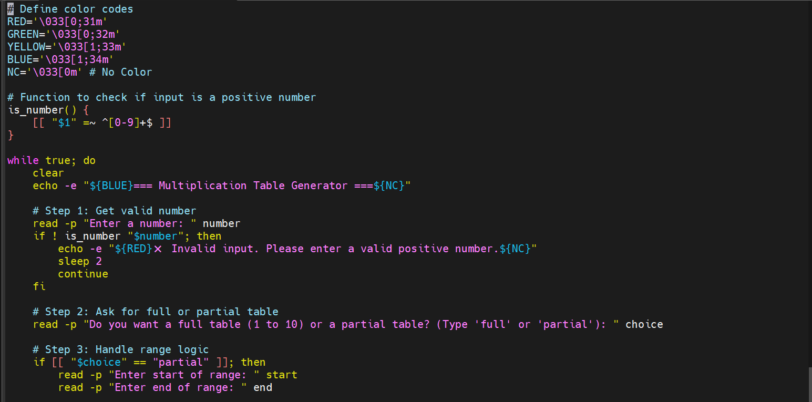
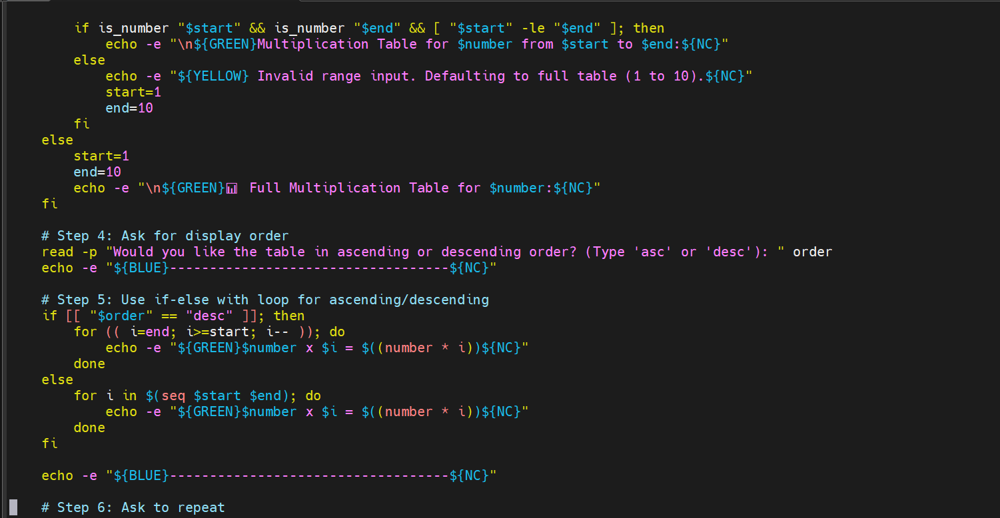
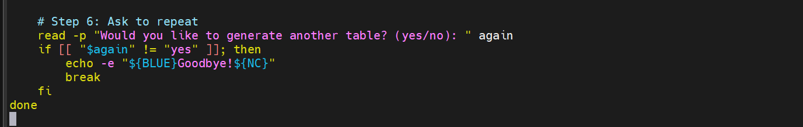
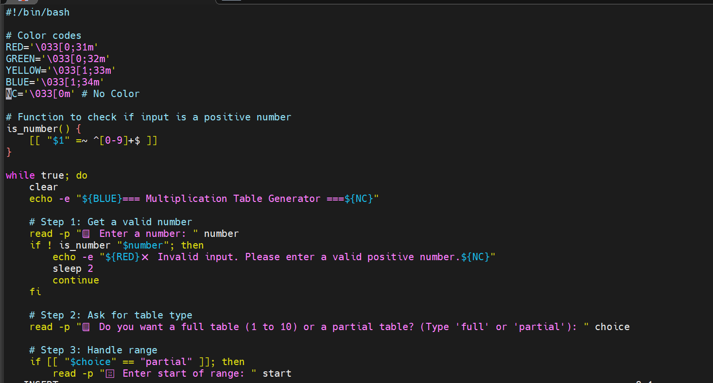
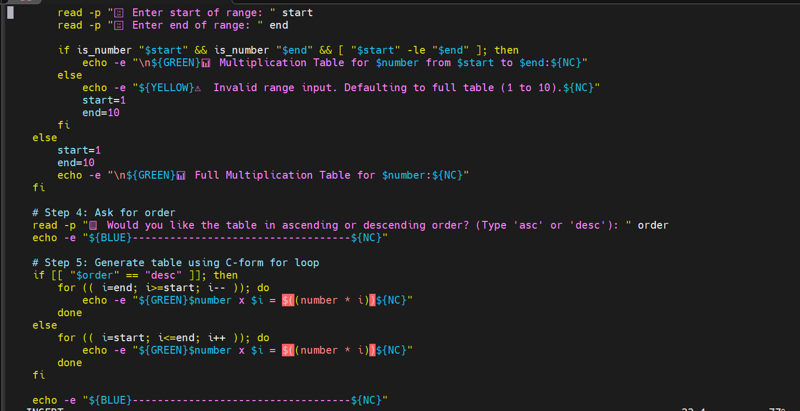
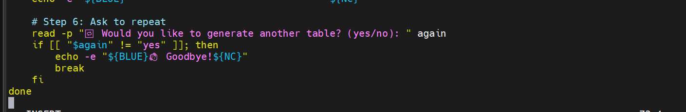

# Bash_Script_for_Generating_A_Multiplication_Table

## Objective:
Create a Bash script that generates a multiplication table for a number entered by the user.

## Project Description:
The script prompts the user to enter a number and ask if they prefer to see a full multiplication table from 1 t0 10 or a partial tabble within a specified range. Based on the user's choice, the script will display the corresponding multiplication table.

## Project Details:
Breakdown of how the script works:

User Input Handling:
The script starts by asking the user to enter a number. Input is validated to ensure it’s a positive integer using regex.

Table Type Selection  :
The user chooses between:  
A full table (1 to 10), or  
A partial table with a custom start and end range.

If the user provides an invalid range (e.g., non-numeric or start > end), the script automatically defaults to the full range (1 to 10) — this avoids breaking the flow.

Order Preference:  
The user can choose to display the table in ascending or descending order.
This is implemented using for loops.

Output Formatting:  
Output is color-coded using ANSI escape codes:

💚 Green: table content

🔵 Blue: headers and prompts

🔴 Red: input errors

🟡 Yellow: fallbacks and warnings

Looping Logic
After showing the table, the script prompts the user whether to repeat the process for another number, or exit.

The screenshots below shows the script using list-form For loop.

The screenshots below shows the script using C-style For loop.

### How the Script works (Simple steps)
1. Prompt the user to enter a number.
2. Ask if they want a full or partial table.
3. If partial:  
    *Ask for a start and end range.  
    *Validate the input.  
    *If invalid, default to full table.
4. Ask if the user wants the table in ascending or descending order.
5. Use a C-style for loop to display the multiplication table.
6. Print results in green color for clarity.
7. Ask the user if they want to repeat or exit.

### Comparing List-form and C-style for loop

Basic syntax for list-form is: 
for i in $(seq $start $end)	

while basic syntax for C-style is: 
for (( i=start; i<=end; i++ ))

For clarity and readability, list-form is easier and beginner friendly.

But C-style offers more power, performance and control.